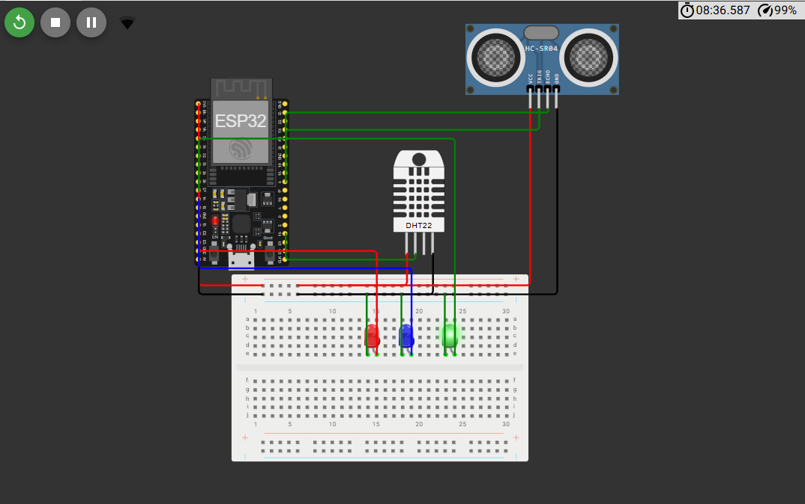

# Monitor de Bem-Estar no Trabalho

## 📘 Descrição do Projeto
Este projeto simula um **sistema IoT de monitoramento ambiental e segurança ocupacional**, alinhado ao tema **“O Futuro do Trabalho”**.  
Ele utiliza sensores para medir **distância, temperatura e umidade**, acionando alertas visuais e enviando dados em tempo real via **MQTT**, demonstrando como a tecnologia pode melhorar o **bem-estar no ambiente de trabalho**.

---

## 🎯 Objetivo
Criar uma aplicação com ESP32 que monitora condições de proximidade e conforto térmico, alertando sobre riscos e publicando as informações em um servidor MQTT acessível por dashboards IoT.

---

## 🧩 Componentes Utilizados (disponíveis no Wokwi)
| Componente | Função | Pino ESP32 |
|-------------|--------|------------|
| HC-SR04 (ultrassônico) | Medir distância | Trig → 5, Echo → 18 |
| DHT22 | Medir temperatura e umidade | Data → 15 |
| LED vermelho | Alerta de proximidade | 12 |
| LED azul | Alerta de calor | 14 |
| LED verde | Funcionamento normal | 27 |

---

## ⚙️ Funcionamento
- Mede a **distância** de objetos próximos com o **HC-SR04**.  
- Lê **temperatura e umidade** com o **DHT22**.  
- Envia os dados via **MQTT** para o broker público `test.mosquitto.org`.  
- Mostra todas as leituras no **Serial Monitor** a cada 2 segundos.  
- Ações automáticas:
  - **LED vermelho acende** se a distância < 10 cm.  
  - **LED azul pisca** se a temperatura > 30 °C.  
  - **LED verde permanece ligado** durante o funcionamento normal.  

---

## 🌐 Comunicação IoT
- **Protocolo:** MQTT  
- **Servidor:** `test.mosquitto.org`  
- **Porta:** `1883`  
- **Tópico:** `gs/bemestar`  
- **Formato da mensagem publicada (JSON):**
  json
  {
    "distancia": 7.2,
    "temperatura": 28.5,
    "umidade": 61.3
  }
## 🔌 Esquema de Ligação (resumo)
HC-SR04 → VCC (3.3V), GND, Trig (5), Echo (18)

DHT22 → VCC (3.3V), GND, Data (15)

LEDs:

Vermelho → 12

Azul → 14

Verde → 27
(todos com o cátodo no GND)

## 🧠 Justificativa e Correspondência com o Tema “O Futuro do Trabalho”
O projeto se alinha ao tema “O Futuro do Trabalho – Conectando pessoas, competências e propósito por meio da tecnologia” ao demonstrar como IoT e automação podem promover ambientes de trabalho mais inteligentes e seguros.

Conexões diretas com o tema:
Bem-estar e segurança ocupacional

Monitora fatores ambientais (temperatura, umidade e distância), essenciais para conforto e segurança.

Pode alertar sobre calor excessivo, superlotação ou risco de colisão com máquinas.

Automação e tomada de decisão inteligente

O ESP32 reage automaticamente às condições, acendendo LEDs e enviando dados a sistemas IoT.

Demonstra autonomia e eficiência em tarefas de monitoramento.

Conectividade e Internet das Coisas (IoT)

Publica dados via MQTT, integrando sensores a plataformas externas de controle e análise.

Sustentabilidade e digitalização do trabalho

Reduz a necessidade de supervisão manual e melhora a eficiência operacional.

Exemplo de como a tecnologia pode otimizar ambientes laborais e reduzir falhas humanas.

Interdisciplinaridade e inovação

Une conhecimentos de tecnologia, ergonomia e automação em uma solução prática e educativa.

Em resumo, o projeto mostra como a tecnologia conecta pessoas e dados para melhorar o trabalho humano, promovendo segurança, conforto e eficiência, pilares do futuro do trabalho digital e automatizado.

## ▶️ Execução no Wokwi
Acesse [o wokwi](https://wokwi.com/projects/447252664581370881) ou instale os arquivos na pasta [wokwi](./wokwi)

## 🧰 Dependências
Biblioteca DHT sensor library

Biblioteca PubSubClient

Biblioteca WiFi.h (nativa do ESP32)

### 📡 Possível Expansão
Dashboard IoT para visualização dos dados.

Envio via HTTP para API ou banco de dados.

Sistema de feedback automatizado (notificações ou relatórios).

## 🔗 Links
[acessar wokwi](https://wokwi.com/projects/447252664581370881)

[video explicativo](https://youtu.be/2OGfu0PylPc)

## 👥 Participantes

Felipe Balbino Murad - RM 562347

Lucas Mesquita Massoni - RM 561686

